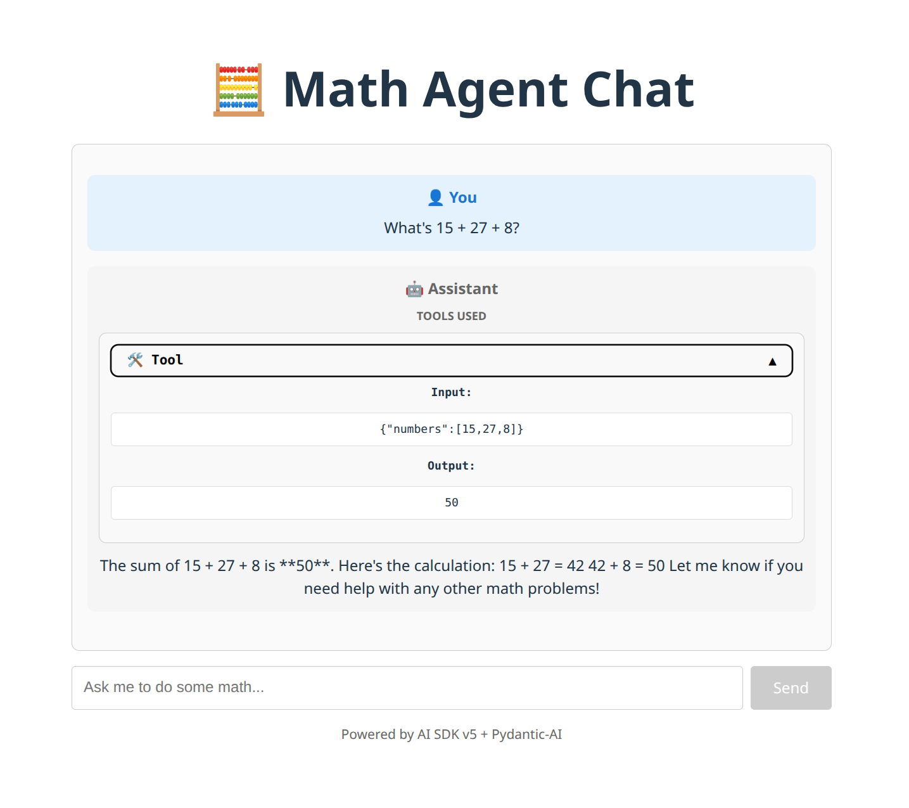

# Pydantic AI + FastAPI + Vercel AI SDK + React Stack

A modern tech stack for building AI agents that combines the best of Python and TypeScript ecosystems. This example demonstrates how to connect **[Pydantic AI](https://ai.pydantic.dev/)** backends with **[Vercel AI SDK](https://ai-sdk.dev/docs/introduction)** frontends through streaming-compatible APIs.



The UI above shows a simple Math Agent example that currently has one tool (sum).

## Tech Stack

### Backend (Python)
- **[Pydantic AI](https://ai.pydantic.dev/)** - Type-safe AI agent framework with structured outputs
- **[FastAPI](https://fastapi.tiangolo.com/)** - Modern, fast web framework for building APIs
- **[uv](https://docs.astral.sh/uv/)** - Blazing fast Python package manager

### Frontend (TypeScript)
- **[React 19](https://react.dev/)** - Modern UI library with hooks
- **[Vite](https://vite.dev/)** - Lightning fast build tool
- **[Vercel AI SDK](https://ai-sdk.dev/docs/introduction)** - Streaming AI interactions
- **[Bun](https://bun.sh/)** - Fast package manager and runtime

## Why This Stack?

**The Honest Truth**
I love Pydantic AI, but it's only available in Python. I love the Vercel AI SDK, but it's only available in TypeScript. This forced me to bridge two worlds that don't naturally talk to each other.

**What I Had to Hack Together**
- Streaming compatibility between Pydantic AI and AI SDK
- Tool call handling across the language boundary
- Custom stream conversion to make everything work seamlessly

**The Good Parts**
- Both ecosystems have excellent hot reloading (FastAPI + Vite)
- uv and Bun are both fantastic package managers

**The Trade-offs**
- No shared type safety across the stack
- Having to maintain code in two languages
- Python and TypeScript don't natively communicate well
- More complexity than a single-language solution

**Why This Repo Exists**
I built this example to show how to make these two amazing but separate ecosystems work together effectively, despite their incompatibilities.

## Prerequisites

Install the required tools for the best developer experience:


### TypeScript: Bun
```bash
# Install Bun - wicked fast package manager and runtime
curl -fsSL https://bun.sh/install | bash
```

### Python: uv
```bash
# Install uv - Python package management as fast as Bun is for TypeScript
curl -LsSf https://astral.sh/uv/install.sh | sh
```

## Quick Start

### 1. Backend Setup

```bash
# Navigate to backend directory
cd agent-backend

# Install dependencies with uv
uv sync

# Start development server with hot-reloading
fastapi dev main.py
```

The backend will be available at `http://localhost:8000`

### 2. Frontend Setup

```bash
# Navigate to frontend directory
cd agent-frontend

# Install dependencies with Bun
bun install

# Start development server
bun run dev
```

The frontend will be available at `http://localhost:5173`

## Project Structure

```
├── agent-backend/          # Python FastAPI backend
│   ├── main.py            # FastAPI app with Pydantic AI agent
│   ├── pyproject.toml     # Python dependencies (uv)
│   └── uv.lock           # Lockfile for reproducible builds
├── agent-frontend/        # React TypeScript frontend
│   ├── src/
│   │   ├── App.tsx       # Main app component
│   │   ├── Chat.tsx      # Chat interface with Vercel AI SDK
│   │   └── ...
│   ├── package.json      # Node.js dependencies (Bun)
│   └── bun.lock         # Lockfile for reproducible builds
└── README.md            # This file
```

## Key Features

### Stream Compatibility
The backend converts Pydantic AI streams to Vercel AI SDK's Data Stream Protocol format, including tool calls and streaming text.

## Development Commands

### Backend (agent-backend/)
- **Development server**: `fastapi dev main.py`
- **Production server**: `fastapi run main.py`
- **Install dependencies**: `uv sync`

### Frontend (agent-frontend/)
- **Development server**: `bun run dev`
- **Build**: `bun run build`
- **Lint**: `bun run lint`
- **Preview build**: `bun run preview`

## Environment Configuration

Create `.env` file in agent-backend directory:

**agent-backend/.env**
```env
GROQ_API_KEY=your_groq_key_here
```

## Model Provider Choice

This example uses [Groq Cloud](https://groq.com/) with the Qwen3 32B model, but you can use any provider that Pydantic AI supports. Check out the full list of supported providers at [https://ai.pydantic.dev/api/providers/](https://ai.pydantic.dev/api/providers/).

**Why Groq + Qwen3 32B?**
I chose this combination because it's cheap and decent at native tool calling.

**Using a Different Provider?**
If you want to use a different provider:
1. Update your environment variables to match the provider's API key name
2. Modify the pydantic-settings configuration in the backend code
3. Update the model name in your agent configuration

For example, to use OpenAI instead:
```env
OPENAI_API_KEY=your_openai_key_here
```

## Learn More

- [Pydantic AI Documentation](https://ai.pydantic.dev/)
- [FastAPI Documentation](https://fastapi.tiangolo.com/)
- [Vercel AI SDK Documentation](https://ai-sdk.dev/docs/introduction)
- [uv Documentation](https://docs.astral.sh/uv/)
- [Bun Documentation](https://bun.sh/docs)

## Usage

This example demonstrates the essential integration between Pydantic AI and Vercel AI SDK. Feel free to clone this repo and use it as a starting point for your own projects.

## License

This project is licensed under the MIT License - see the [LICENSE.md](LICENSE.md) file for details.
